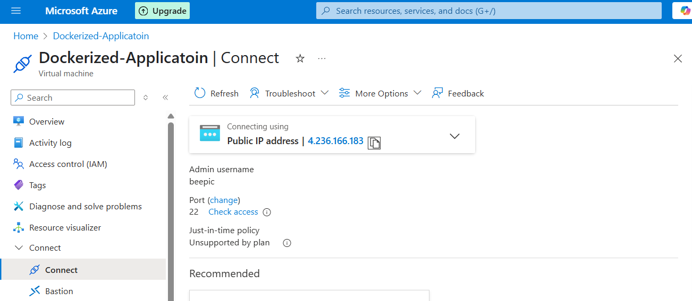

# 🚀 Deploying a Dockerized Application on a Virtual Machine

This project demonstrates the end-to-end process of deploying a Dockerized application on a virtual machine (VM). It enhances deployment efficiency through containerization and enables smooth application access via Docker networking.

---

## 📌 Project Overview

> **Objective**: Deploy a web-based application (QR Generator) inside a Docker container on a virtual machine, showcasing best practices in Docker image management, deployment, and networking.

---

## 🧰 Technologies Used

- Docker
- Ubuntu Virtual Machine (Azure)
- Docker Hub
- Bash (for installation and setup)

---


---

## ⚙️ Steps to Reproduce

### 1. Clone the Repository and install all the dependencies
```bash
git clone https://github.com/gopalepic/QR-Generator-with-Containerization.git

cd qr-generator-docker-vm

sudo apt update

sudo apt install npm 

npm instll

sudo apt install docker.io -y

```

### 2. Build the Docker Image Locally
```bash
 docker build -t beepic/qr-generator-latest .

```


### 3. Tag the Image for Docker Hub

``` bash
docker tag beepic/qr-generator-latest:latest beepic/qr-generator:latest

```

### 4. Push to Docker hub 

``` bash
   docker login 
   docker push beepic/qr-generator:latest
```


### 5. 5. Launch a Virtual Machine

1. Use Azure Virtual Machine 

2. Login to VM through SSH

3.  Install Dependencies
sudo apt update
sudo apt install docker.io -y




### Pull the Docker Image from Docker Hub


``` bash

docker pull beepic/qr-generator

```

### Run the Docker Image at Specific Port , 

``` bash
docker run -p 3000:3000 beepic/qr-generator-latest

```

### The running docker Container 

 You can also access it by pinging my Public IP address : 4.236.166.183:3000


# Running QR Web Application 


### for source code , please refer :

```bash

https://github.com/gopalepic/QR-Generator-with-Containerization.git
```