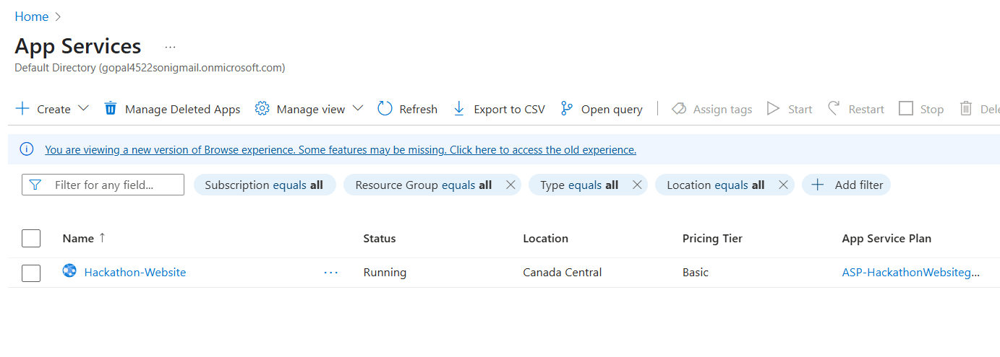

# Assignments of week 2

## 1) Deploy Linux and Windows virtual machine and access them using SSH and RDP

### for Linux VM
1. Sign up and log in to your chosen cloud provider.
2. Navigate to the VM creation section (e.g., "Droplets" in DigitalOcean).
3. Select a Linux distribution (e.g., Ubuntu).
4. Choose the appropriate plan based on your resource needs.
5. Configure networking settings and create the VM.
6. Obtain the Public IP address.


```bash

ssh -i "location of .pem file " ubuntu@public_IP_Address

```
### For windows VM

1. Create Windows VM

2. se RDP (Remote Desktop Connection)

3. opne it and just put the IP address


## 2) Create an App Service Plan Provision a Web App in the existing App Service Plan and deploy a simple welcome page on it 

1. Search for Web app in searchbox

2. As my website was based on Nodejs techstack , so i choose the programming language as Nodejs 

3. share the github repo of your project 

4. upload it 



## 3) Create ACR and pull image from ACR and Create a container from it

  1. First Create a Resource group , i made ACR Resource group

  2. Search Azure Container Registry and Click on it 

  3. click on "Add/Create Container Registry"

  4. Use the specified resource group that you created earlier

  5. Depoly your Container image to the Container registry 

  

  project Link : https://github.com/gopalepic/QR-Generator-with-Containerization

  ## 4) Create Container Instance and deploy a simple docker application on it. Create Container Groups and test functionality

  1) Create a differnt Resouce group , i created ACI

  2) Search for Container Instance , click on create 

  3) Fill the details and as i was already have a container image uploaded , i used that one 

  4) problems may arise during ports , my application was on port 3000 , so i created an extra TCP protocol port of 3000 and enabled it 

  5) Click on Review and create and done , you have your's first Running Container Instance 

  

